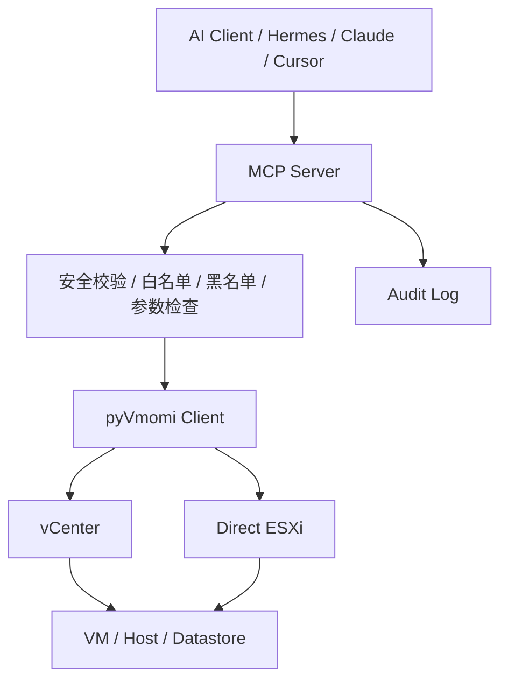
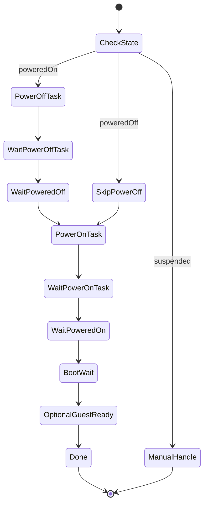

# ESXi / vSphere MCP 资源巡检与电源管理规划文档

版本：v1.0  
日期：2026-05-13  
适用范围：ESXi / vCenter 虚拟机资源巡检、强制关机、开机、强制重启

---

## 1. 背景与目标

当前需求不是完整管理 ESXi / vSphere，而是面向日常运维中的轻量场景：

- 查询虚拟机状态
- 查询宿主机资源
- 虚拟机强制关机
- 虚拟机开机
- 虚拟机强制重启
- 在关机、开机比较慢时，能够自动识别状态并等待完成

因此不建议使用“大而全”的 ESXi MCP，而是基于 `pyVmomi` 封装一个轻量 MCP Server。

整体目标是：

```text
AI / Hermes / Claude / Cursor
        ↓
自定义 MCP Server
        ↓
pyVmomi
        ↓
vCenter 或 ESXi
```

优先推荐连接 vCenter；如果环境中没有 vCenter，再直连单台 ESXi。

---

## 2. 设计原则

### 2.1 只做必要功能

本 MCP 只暴露资源巡检和电源管理能力。

保留：

```text
list_vms
get_vm_status
list_hosts
get_host_resource
power_on_vm
power_off_vm
restart_vm_force
```

不暴露：

```text
delete_vm
create_vm
clone_vm
snapshot_vm
remove_snapshot
migrate_vm
reconfig_vm
edit_network
edit_disk
edit_cpu_memory
```

原因是当前目标是“巡检 + 故障恢复”，不是完整虚拟化平台管理。

---

### 2.2 写操作必须受控

写操作只允许：

```text
PowerOnVM_Task
PowerOffVM_Task
restart_vm_force
```

其中：

- `power_on_vm` 可以直接执行，但需要记录日志
- `power_off_vm` 必须要求 `confirm=true`
- `restart_vm_force` 必须要求 `confirm=true`
- 禁止模糊批量匹配
- 建议只允许白名单虚拟机执行强制关机和强制重启
- 关键虚拟机加入黑名单，例如 vCenter、数据库、核心中间件等

---

### 2.3 不只等待 Task，还要等待 VM 状态

vSphere 的 Task 成功，只能说明这个 vSphere 操作完成，不代表虚拟机业务已经完全可用。

所以必须同时做两层等待：

```text
1. 等待 Task 成功
2. 继续轮询 vm.runtime.powerState
```

强制重启的关键流程是：

```text
PowerOffVM_Task
  ↓
wait task success
  ↓
wait runtime.powerState == poweredOff
  ↓
PowerOnVM_Task
  ↓
wait task success
  ↓
wait runtime.powerState == poweredOn
  ↓
optional: wait VMware Tools / IP / heartbeat
```

---

## 3. 总体架构



---

## 4. MCP 工具规划

### 4.1 list_vms

#### 功能

列出虚拟机基础信息。

#### 入参

```json
{
  "keyword": "可选，按名称过滤",
  "power_state": "可选，poweredOn / poweredOff / suspended"
}
```

#### 出参

```json
{
  "items": [
    {
      "name": "test-vm-01",
      "moid": "vm-123",
      "uuid": "421f...",
      "power_state": "poweredOn",
      "host": "esxi-01.local",
      "ip": "192.168.1.10",
      "cpu": 4,
      "memory_mb": 8192
    }
  ]
}
```

#### 说明

- 只读工具
- 可以支持关键字过滤
- 不做批量操作
- 返回 `moid` 和 `uuid`，方便后续精确操作

---

### 4.2 get_vm_status

#### 功能

查询单台虚拟机详细状态。

#### 入参

推荐优先使用 `uuid` 或 `moid`，其次才使用 `vm_name`。

```json
{
  "vm_name": "test-vm-01",
  "uuid": "可选",
  "moid": "可选"
}
```

#### 出参

```json
{
  "name": "test-vm-01",
  "moid": "vm-123",
  "uuid": "421f...",
  "power_state": "poweredOn",
  "connection_state": "connected",
  "host": "esxi-01.local",
  "ip": "192.168.1.10",
  "tools_status": "toolsOk",
  "boot_time": "2026-05-13 09:10:00",
  "cpu": 4,
  "memory_mb": 8192
}
```

#### 说明

重点关注：

```text
vm.runtime.powerState
vm.runtime.connectionState
vm.runtime.host
vm.runtime.bootTime
vm.guest.ipAddress
vm.guest.toolsStatus
```

---

### 4.3 list_hosts

#### 功能

列出 ESXi 宿主机基础状态。

#### 入参

```json
{
  "keyword": "可选，按主机名过滤"
}
```

#### 出参

```json
{
  "items": [
    {
      "name": "esxi-01.local",
      "connection_state": "connected",
      "power_state": "poweredOn",
      "maintenance_mode": false,
      "cpu_cores": 32,
      "memory_total_gb": 256
    }
  ]
}
```

---

### 4.4 get_host_resource

#### 功能

查询宿主机资源摘要。

#### 入参

```json
{
  "host_name": "esxi-01.local"
}
```

#### 出参

```json
{
  "name": "esxi-01.local",
  "connection_state": "connected",
  "maintenance_mode": false,
  "cpu_total_mhz": 76800,
  "cpu_used_mhz": 32000,
  "memory_total_mb": 262144,
  "memory_used_mb": 131072,
  "vm_count": 36
}
```

#### 说明

该工具用于资源巡检，不执行任何修改操作。

---

### 4.5 power_on_vm

#### 功能

启动指定虚拟机。

#### 入参

```json
{
  "vm_name": "test-vm-01",
  "uuid": "可选",
  "moid": "可选",
  "task_timeout": 300,
  "state_timeout": 900
}
```

#### 执行逻辑

```text
1. 精确定位 VM
2. 查询当前 powerState
3. 如果已经 poweredOn，直接返回 already_powered_on
4. 如果是 poweredOff，执行 PowerOnVM_Task
5. 等待 Task 成功
6. 继续轮询 runtime.powerState，直到 poweredOn
7. 返回最终状态
```

#### 出参

```json
{
  "vm": "test-vm-01",
  "result": "powered_on",
  "before_power_state": "poweredOff",
  "after_power_state": "poweredOn",
  "steps": [
    "poweron_task_start",
    "poweron_task_success",
    "vm_powered_on_confirmed"
  ]
}
```

---

### 4.6 power_off_vm

#### 功能

强制关闭指定虚拟机，相当于断电。

#### 入参

```json
{
  "vm_name": "test-vm-01",
  "uuid": "可选",
  "moid": "可选",
  "confirm": true,
  "task_timeout": 300,
  "state_timeout": 900
}
```

#### 执行逻辑

```text
1. 检查 confirm 是否为 true
2. 检查 VM 是否在允许操作的白名单中
3. 检查 VM 是否在禁止操作的黑名单中
4. 精确定位 VM
5. 查询当前 powerState
6. 如果已经 poweredOff，直接返回 already_powered_off
7. 如果是 poweredOn，执行 PowerOffVM_Task
8. 等待 Task 成功
9. 继续轮询 runtime.powerState，直到 poweredOff
10. 返回最终状态
```

#### 出参

```json
{
  "vm": "test-vm-01",
  "result": "powered_off",
  "before_power_state": "poweredOn",
  "after_power_state": "poweredOff",
  "steps": [
    "poweroff_task_start",
    "poweroff_task_success",
    "vm_powered_off_confirmed"
  ]
}
```

#### 注意

`PowerOffVM_Task` 是强制关机，不是操作系统内优雅关机。

如果后续想支持优雅关机，可以额外增加：

```text
shutdown_guest_vm
```

但当前需求中不作为核心能力。

---

### 4.7 restart_vm_force

#### 功能

强制重启指定虚拟机。

适用于虚拟机卡死、无法正常响应、需要强制断电再开机的场景。

#### 入参

```json
{
  "vm_name": "test-vm-01",
  "uuid": "可选",
  "moid": "可选",
  "confirm": true,
  "poweroff_task_timeout": 300,
  "poweroff_state_timeout": 900,
  "poweron_task_timeout": 300,
  "poweron_state_timeout": 900,
  "boot_wait": 30,
  "wait_guest_ready": false
}
```

#### 执行逻辑

```text
1. 检查 confirm 是否为 true
2. 检查白名单和黑名单
3. 精确定位 VM
4. 查询当前 powerState

5. 如果 VM 是 poweredOn：
     执行 PowerOffVM_Task
     等待 Task 成功
     继续轮询 runtime.powerState == poweredOff

6. 如果 VM 已经是 poweredOff：
     跳过 PowerOffVM_Task

7. 如果 VM 是 suspended：
     默认不处理，返回需要人工确认

8. 执行 PowerOnVM_Task
9. 等待 Task 成功
10. 继续轮询 runtime.powerState == poweredOn
11. 可选等待 boot_wait 秒
12. 可选等待 VMware Tools / IP 恢复
13. 返回最终状态
```

#### 状态机



#### 出参

```json
{
  "vm": "test-vm-01",
  "result": "restarted",
  "before": {
    "power_state": "poweredOn",
    "host": "esxi-01.local",
    "ip": "192.168.1.10"
  },
  "after": {
    "power_state": "poweredOn",
    "host": "esxi-01.local",
    "ip": "192.168.1.10",
    "tools_status": "toolsOk"
  },
  "steps": [
    "poweroff_task_start",
    "poweroff_task_success",
    "vm_powered_off_confirmed",
    "poweron_task_start",
    "poweron_task_success",
    "vm_powered_on_confirmed",
    "boot_wait_finished"
  ]
}
```

---

## 5. 状态识别策略

### 5.1 Task 状态

用于判断 vSphere 操作是否完成。

关注：

```text
task.info.state
task.info.error
```

典型状态：

```text
queued
running
success
error
```

---

### 5.2 VM 电源状态

用于判断虚拟机是否真的关机或开机。

关注：

```text
vm.runtime.powerState
```

典型状态：

```text
poweredOn
poweredOff
suspended
```

---

### 5.3 Guest 状态，可选

如果需要判断系统是否真正启动，可以额外关注：

```text
vm.guest.toolsStatus
vm.guest.ipAddress
vm.guest.guestState
```

但这些依赖 VMware Tools，不建议作为强制条件。

推荐策略：

```text
基础判断：
runtime.powerState == poweredOn

增强判断：
runtime.powerState == poweredOn
并且 VMware Tools 正常
并且 IP 地址存在
```

---

### 5.4 业务可用性，可选

如果未来要判断服务是否恢复，可以加端口探测。

例如：

```json
{
  "wait_port": 22,
  "wait_port_timeout": 300
}
```

但这属于扩展能力，不建议放在第一版核心功能里。

---

## 6. 超时设计

推荐默认值：

```yaml
timeouts:
  task_timeout: 300
  poweroff_state_timeout: 900
  poweron_state_timeout: 900
  boot_wait: 30
```

不同类型 VM 建议：

| 类型 | poweroff_state_timeout | poweron_state_timeout | 说明 |
|---|---:|---:|---|
| 普通 Linux VM | 300 秒 | 300 秒 | 通常较快 |
| Windows VM | 900 秒 | 900 秒 | 关机、启动可能较慢 |
| 大内存 VM | 900 秒 | 900 秒 | BIOS/系统启动较慢 |
| 数据库 VM | 不建议默认允许 | 不建议默认允许 | 必须白名单控制 |
| vCenter / 核心组件 | 禁止 | 禁止 | 放入黑名单 |

---

## 7. 安全控制

### 7.1 最小权限账号

建议创建专门的 vSphere 巡检账号，例如：

```text
svc_mcp_vsphere
```

只授予必要权限。

只读巡检权限：

```text
System.View
Datastore.Browse
Host.Inventory
VirtualMachine.Inventory
VirtualMachine.Config.Query
```

电源管理权限：

```text
VirtualMachine.Interact.PowerOn
VirtualMachine.Interact.PowerOff
```

如果后续支持优雅关机，再加：

```text
VirtualMachine.Interact.GuestControl
```

---

### 7.2 白名单与黑名单

推荐配置：

```yaml
safety:
  require_confirm_for_poweroff: true
  require_confirm_for_restart: true

  allow_power_ops:
    - test-vm-01
    - app-vm-*
    - dev-*

  deny_power_ops:
    - vcenter*
    - vcsa*
    - db-prod-*
    - mysql-prod-*
    - postgres-prod-*
    - redis-prod-*
    - k8s-master-*
```

建议规则：

```text
1. 黑名单优先级高于白名单
2. 不允许空白名单执行 power_off_vm / restart_vm_force
3. 不允许模糊匹配到多个 VM 后执行写操作
4. 写操作必须精确定位到唯一 VM
```

---

### 7.3 操作审计

所有写操作必须记录日志。

建议 JSON Lines 格式：

```json
{
  "time": "2026-05-13T09:30:00+08:00",
  "operator": "mcp-user",
  "tool": "restart_vm_force",
  "vm": "test-vm-01",
  "moid": "vm-123",
  "before_power_state": "poweredOn",
  "after_power_state": "poweredOn",
  "result": "success",
  "duration_seconds": 186
}
```

失败也必须记录：

```json
{
  "time": "2026-05-13T09:35:00+08:00",
  "operator": "mcp-user",
  "tool": "power_off_vm",
  "vm": "db-prod-01",
  "result": "blocked",
  "reason": "VM matched deny_power_ops"
}
```

---

## 8. 配置文件设计

建议使用 `config.yaml`。

```yaml
vsphere:
  host: "vcenter.example.com"
  port: 443
  username: "svc_mcp_vsphere"
  password_env: "VSPHERE_PASSWORD"
  insecure_ssl: true

mcp:
  name: "esxi-power-mcp"
  readonly_default: true

timeouts:
  task_timeout: 300
  poweroff_state_timeout: 900
  poweron_state_timeout: 900
  boot_wait: 30

safety:
  require_confirm_for_poweroff: true
  require_confirm_for_restart: true

  allow_power_ops:
    - "test-vm-01"
    - "app-*"
    - "dev-*"

  deny_power_ops:
    - "vcenter*"
    - "vcsa*"
    - "db-prod-*"
    - "mysql-prod-*"
    - "postgres-prod-*"
    - "redis-prod-*"
    - "k8s-master-*"

audit:
  enabled: true
  file: "./logs/audit.log"
```

密码建议使用环境变量：

```bash
export VSPHERE_PASSWORD='your-password'
```

不建议把密码直接写到配置文件。

---

## 9. 项目目录规划

```text
esxi-power-mcp/
├── README.md
├── requirements.txt
├── config.yaml
├── server.py
├── vsphere_client.py
├── vm_power.py
├── vm_inventory.py
├── host_inventory.py
├── safety.py
├── audit.py
├── logs/
│   └── audit.log
└── tests/
    ├── test_safety.py
    └── test_power_logic.py
```

说明：

| 文件 | 作用 |
|---|---|
| `server.py` | MCP Server 入口 |
| `vsphere_client.py` | vCenter / ESXi 连接封装 |
| `vm_power.py` | PowerOn / PowerOff / Restart 逻辑 |
| `vm_inventory.py` | VM 查询与状态读取 |
| `host_inventory.py` | 宿主机资源巡检 |
| `safety.py` | 白名单、黑名单、confirm 校验 |
| `audit.py` | 操作审计日志 |
| `config.yaml` | 运行配置 |

---

## 10. Python 核心逻辑示例

### 10.1 等待 Task

```python
import time
from pyVmomi import vim


def wait_task(task, timeout=300, interval=2):
    start = time.time()

    while True:
        state = task.info.state

        if state == vim.TaskInfo.State.success:
            return True

        if state == vim.TaskInfo.State.error:
            err = task.info.error
            msg = getattr(err, "msg", str(err))
            raise Exception(f"Task failed: {msg}")

        if time.time() - start > timeout:
            raise TimeoutError(f"Task timeout after {timeout}s")

        time.sleep(interval)
```

---

### 10.2 等待虚拟机电源状态

```python
import time


def wait_power_state(vm, target_state, timeout=900, interval=5):
    start = time.time()

    while True:
        current = vm.runtime.powerState

        if current == target_state:
            return True

        if time.time() - start > timeout:
            raise TimeoutError(
                f"Wait power state timeout. "
                f"vm={vm.name}, current={current}, target={target_state}"
            )

        time.sleep(interval)
```

---

### 10.3 查询 VM 当前状态

```python
def refresh_vm_status(vm):
    return {
        "name": vm.name,
        "power_state": str(vm.runtime.powerState),
        "connection_state": str(vm.runtime.connectionState),
        "host": vm.runtime.host.name if vm.runtime.host else None,
        "boot_time": str(vm.runtime.bootTime) if vm.runtime.bootTime else None,
        "ip": vm.guest.ipAddress if vm.guest else None,
        "tools_status": str(vm.guest.toolsStatus) if vm.guest else None,
    }
```

---

### 10.4 强制重启核心逻辑

```python
import time
from pyVmomi import vim


def restart_vm_force(
    vm,
    confirm=False,
    poweroff_task_timeout=300,
    poweroff_state_timeout=900,
    poweron_task_timeout=300,
    poweron_state_timeout=900,
    boot_wait=30,
):
    if not confirm:
        raise Exception("restart_vm_force is dangerous, confirm=True required")

    result = {
        "vm": vm.name,
        "before": refresh_vm_status(vm),
        "steps": [],
    }

    current = vm.runtime.powerState

    if current == vim.VirtualMachinePowerState.poweredOn:
        result["steps"].append("poweroff_task_start")

        task = vm.PowerOffVM_Task()
        wait_task(task, timeout=poweroff_task_timeout)

        result["steps"].append("poweroff_task_success")

        wait_power_state(
            vm,
            vim.VirtualMachinePowerState.poweredOff,
            timeout=poweroff_state_timeout,
        )

        result["steps"].append("vm_powered_off_confirmed")

    elif current == vim.VirtualMachinePowerState.poweredOff:
        result["steps"].append("already_powered_off_skip_poweroff")

    elif current == vim.VirtualMachinePowerState.suspended:
        raise Exception(f"VM is suspended, manual handling recommended: {vm.name}")

    else:
        raise Exception(f"Unknown VM power state: {current}")

    result["steps"].append("poweron_task_start")

    task = vm.PowerOnVM_Task()
    wait_task(task, timeout=poweron_task_timeout)

    result["steps"].append("poweron_task_success")

    wait_power_state(
        vm,
        vim.VirtualMachinePowerState.poweredOn,
        timeout=poweron_state_timeout,
    )

    result["steps"].append("vm_powered_on_confirmed")

    if boot_wait > 0:
        time.sleep(boot_wait)
        result["steps"].append("boot_wait_finished")

    result["after"] = refresh_vm_status(vm)
    result["result"] = "restarted"

    return result
```

---

## 11. MCP Server 工具定义示例

可以使用 Python MCP SDK 或 FastMCP 风格封装。

伪代码示例：

```python
from mcp.server.fastmcp import FastMCP

mcp = FastMCP("esxi-power-mcp")


@mcp.tool()
def get_vm_status(vm_name: str = None, uuid: str = None, moid: str = None):
    """
    查询虚拟机状态。
    """
    vm = find_vm(vm_name=vm_name, uuid=uuid, moid=moid)
    return refresh_vm_status(vm)


@mcp.tool()
def power_on_vm(
    vm_name: str = None,
    uuid: str = None,
    moid: str = None,
    task_timeout: int = 300,
    state_timeout: int = 900,
):
    """
    启动虚拟机。
    """
    vm = find_vm(vm_name=vm_name, uuid=uuid, moid=moid)
    return power_on_vm_impl(
        vm,
        task_timeout=task_timeout,
        state_timeout=state_timeout,
    )


@mcp.tool()
def power_off_vm(
    vm_name: str = None,
    uuid: str = None,
    moid: str = None,
    confirm: bool = False,
    task_timeout: int = 300,
    state_timeout: int = 900,
):
    """
    强制关闭虚拟机。
    """
    vm = find_vm(vm_name=vm_name, uuid=uuid, moid=moid)
    check_power_permission(vm.name, action="power_off", confirm=confirm)

    return power_off_vm_impl(
        vm,
        task_timeout=task_timeout,
        state_timeout=state_timeout,
    )


@mcp.tool()
def restart_vm_force(
    vm_name: str = None,
    uuid: str = None,
    moid: str = None,
    confirm: bool = False,
    poweroff_task_timeout: int = 300,
    poweroff_state_timeout: int = 900,
    poweron_task_timeout: int = 300,
    poweron_state_timeout: int = 900,
    boot_wait: int = 30,
):
    """
    强制重启虚拟机。
    """
    vm = find_vm(vm_name=vm_name, uuid=uuid, moid=moid)
    check_power_permission(vm.name, action="restart_force", confirm=confirm)

    return restart_vm_force_impl(
        vm,
        confirm=confirm,
        poweroff_task_timeout=poweroff_task_timeout,
        poweroff_state_timeout=poweroff_state_timeout,
        poweron_task_timeout=poweron_task_timeout,
        poweron_state_timeout=poweron_state_timeout,
        boot_wait=boot_wait,
    )
```

---

## 12. 异常处理规划

需要明确返回错误原因，不能只返回“失败”。

常见错误：

| 错误 | 可能原因 | 处理方式 |
|---|---|---|
| `VM not found` | VM 名称不存在 | 返回明确错误 |
| `VM name duplicated` | 多个 VM 重名 | 要求使用 uuid 或 moid |
| `TaskInProgress` | VM 正在执行其他任务 | 等待或稍后重试 |
| `InvalidPowerState` | 当前状态不允许操作 | 返回当前 powerState |
| `NoPermission` | 账号权限不足 | 返回缺失权限 |
| `Timedout` | 关机或开机超过预期 | 返回当前状态，建议人工检查 |
| `Host not connected` | 宿主机断连 | 返回宿主机连接状态 |
| `Maintenance mode` | 主机维护模式 | 不执行开机 |

---

## 13. 日志规划

### 13.1 访问日志

记录所有 MCP 调用：

```json
{
  "time": "2026-05-13T09:10:00+08:00",
  "tool": "get_vm_status",
  "vm": "test-vm-01",
  "result": "success"
}
```

### 13.2 操作日志

记录所有写操作：

```json
{
  "time": "2026-05-13T09:12:00+08:00",
  "tool": "restart_vm_force",
  "vm": "test-vm-01",
  "confirm": true,
  "before_power_state": "poweredOn",
  "after_power_state": "poweredOn",
  "result": "success",
  "duration_seconds": 180
}
```

### 13.3 错误日志

```json
{
  "time": "2026-05-13T09:15:00+08:00",
  "tool": "power_off_vm",
  "vm": "db-prod-01",
  "result": "blocked",
  "error": "VM matched deny_power_ops"
}
```

---

## 14. 部署方式

### 14.1 requirements.txt

```text
pyvmomi
mcp
pyyaml
pydantic
```

### 14.2 启动方式

```bash
export VSPHERE_PASSWORD='your-password'
python server.py
```

### 14.3 systemd 托管示例

```ini
[Unit]
Description=ESXi Power MCP Server
After=network.target

[Service]
Type=simple
User=mcp
WorkingDirectory=/opt/esxi-power-mcp
Environment="VSPHERE_PASSWORD=your-password"
ExecStart=/opt/esxi-power-mcp/.venv/bin/python server.py
Restart=always
RestartSec=5

[Install]
WantedBy=multi-user.target
```

---

## 15. 验证流程

### 15.1 第一阶段：只读验证

先实现：

```text
list_vms
get_vm_status
list_hosts
get_host_resource
```

验证：

```text
1. 能连接 vCenter / ESXi
2. 能列出 VM
3. 能拿到 powerState
4. 能拿到 host 信息
5. 不执行任何写操作
```

---

### 15.2 第二阶段：开机验证

选择测试 VM：

```text
test-vm-01
```

测试：

```text
1. 手动关闭 VM
2. 调用 power_on_vm
3. 确认 Task 成功
4. 确认 runtime.powerState == poweredOn
5. 查看审计日志
```

---

### 15.3 第三阶段：强制关机验证

测试：

```text
1. 确认 VM 在白名单
2. 调用 power_off_vm confirm=true
3. 确认 Task 成功
4. 确认 runtime.powerState == poweredOff
5. 查看审计日志
```

---

### 15.4 第四阶段：强制重启验证

测试：

```text
1. VM 当前 poweredOn
2. 调用 restart_vm_force confirm=true
3. 确认先进入 poweredOff
4. 再确认进入 poweredOn
5. 确认最终状态返回正常
6. 查看审计日志
```

---

## 16. 推荐实施路线

### Milestone 1：脚本验证

目标：

```text
不用 MCP，先用 Python 脚本验证 pyVmomi 能连接和操作
```

实现：

```text
connect_vcenter
find_vm
get_vm_status
power_on_vm
power_off_vm
restart_vm_force
```

---

### Milestone 2：封装 MCP

目标：

```text
把已验证的 Python 函数封装成 MCP tools
```

实现：

```text
get_vm_status
power_on_vm
power_off_vm
restart_vm_force
```

---

### Milestone 3：安全控制

目标：

```text
防止误操作生产虚拟机
```

实现：

```text
confirm 参数
白名单
黑名单
审计日志
禁止模糊批量操作
```

---

### Milestone 4：接入 Hermes / Claude / Cursor

目标：

```text
通过 AI 调用 MCP 完成资源巡检和故障恢复
```

示例指令：

```text
查看 test-vm-01 当前状态
强制重启 test-vm-01，confirm=true
查看 esxi-01.local 当前资源使用
```

---

## 17. 最终建议

本项目应该定位为：

```text
ESXi / vSphere 轻量电源恢复 MCP
```

而不是：

```text
完整 vSphere 管理 MCP
```

第一版只做：

```text
1. list_vms
2. get_vm_status
3. list_hosts
4. get_host_resource
5. power_on_vm
6. power_off_vm
7. restart_vm_force
```

其中最核心的是：

```text
restart_vm_force =
    PowerOffVM_Task
    + wait task success
    + wait runtime.powerState == poweredOff
    + PowerOnVM_Task
    + wait task success
    + wait runtime.powerState == poweredOn
```

只要把状态识别、超时、白名单、黑名单、审计日志做好，这个 MCP 就足够满足当前“虚拟机异常时快速恢复”的运维场景。
